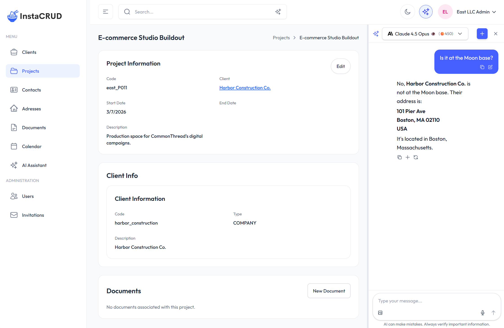

# Agentic Page Assistant

This document describes the architecture of the **Agentic Page Assistant** — the contextual AI panel that opens alongside any admin page — and explains how to extend it with per-page context.



For the user-facing description, see [Agentic Page Assistant (User Guide)](../user-guide/agentic-page-assistant.md).

---

## Architecture Overview

The agentic assistant reuses the existing chat infrastructure (`useConversation`, `useChatStream`, `useAiModels`) and adds a parallel state layer that tracks panel visibility, page context, and a per-navigation conversation ID.

```
AdminLayout
├── AiPanelProvider                  ← global state (context, panel open/close)
│   └── AdminLayoutInner
│       ├── AppHeader (✦ button)
│       ├── ResizablePanel           ← splits screen when panel is open
│       │   ├── left:  page content (children)
│       │   └── right: InPageChat
│       └── [page components]
│           └── useAiPageContext()   ← pages publish context here
```

Panel conversations land in the same global history as the full-screen assistant — no separate storage.

---

## Key Files

| File | Role |
|------|------|
| `frontend/src/context/AiPanelContext.tsx` | Global state: panel open/close, page context and system prompt, panel conversation ID, exclusion list |
| `frontend/src/components/ai-panel/InPageChat.tsx` | Compact chat panel; reuses `useConversation` + `useChatStream`; always sends `tools: "*"` |
| `frontend/src/components/ai-panel/ResizablePanel.tsx` | Two-pane split with drag handle; starts 2/3 – 1/3, clamped 25–80 % |
| `frontend/src/hooks/useAiPageContext.ts` | Drop-in hook for pages to publish `context` and `systemPrompt` |
| `frontend/src/app/(admin)/layout.tsx` | Wraps everything in `AiPanelProvider`; resets panel and conversation ID on navigation |
| `backend/instacrud/api/ai_api.py` | `POST /chat` — substitutes `$PATH`/`$CONTEXT`, then either runs the agentic loop or plain completion |
| `backend/instacrud/api/ai_dto.py` | `ChatRequest` DTO with `system_prompt`, `path`, `context`, `tools` |

---

## Context and System Prompt

The two most important customization points are `context` (what the assistant _knows_) and `systemPrompt` (how it _behaves_).

### How pages publish them

Call `useAiPageContext` anywhere in a page or component:

```typescript
import { useAiPageContext } from '@/hooks/useAiPageContext';

useAiPageContext({
  context: JSON.stringify(myData),   // serialized snapshot of the page's data
  systemPrompt: `...`,               // optional; falls back to the generic template
});
```

The hook pushes both values into `AiPanelContext` and clears them on unmount, so stale context never leaks to the next page.

### Where context is hooked in

Context is registered at the generic component level so individual pages don't need changes:

| Component | What is registered |
|-----------|-------------------|
| `EntityGrid` | `JSON.stringify(rows)` — the full visible row set, updated when rows change |
| `EntityDetailView` | `JSON.stringify(item)` — the open record, updated when the item changes |
| `Calendar` | Array of `{ id, title, start, end, type, entityId }` for all loaded events |

Adding context to a new page follows the same pattern: call `useAiPageContext` with the data the assistant should know about.

### System prompt: generic vs. page-provided

`InPageChat` picks the effective system prompt this way:

1. If the current page published a non-empty `systemPrompt` via `useAiPageContext` → use that.
2. Otherwise → use the generic template defined in `AiPanelContext`:

```
The user is on $PATH and is seeing the following data:
$CONTEXT

Answer their question helpfully and concisely.
```

Before the request reaches the LLM, the backend substitutes:

| Variable | Replaced with |
|----------|--------------|
| `$PATH` | Current page route, e.g. `/clients/abc123` |
| `$CONTEXT` | The serialized context string published by the page |

Substitution is a single-pass regex replace (injection-safe). If the page passed no context, `$CONTEXT` is simply omitted from the prompt.

**To give a page its own agentic persona**, supply a `systemPrompt` that positions the assistant for that context:

```typescript
useAiPageContext({
  context: JSON.stringify(project),
  systemPrompt: `You are an agentic project assistant.
The user is reviewing a project at $PATH.
Project data:
$CONTEXT

You can read and update project records using your tools.`,
});
```

The generic template is intentionally minimal — page-level overrides are the right place to add domain instructions, tone, or tool guidance.

---

## Backend: `/chat` Endpoint

The endpoint has two execution paths depending on the `tools` field.

**With `tools == "*"`** (what `InPageChat` always sends):

```
POST /chat
  → build SystemMessage from system_prompt (with $PATH/$CONTEXT substitution)
  → append _TOOL_DIRECTIVE to the system message
  → bind ALL_TOOLS to the model
  → run LangChain agentic loop (max 10 iterations)
  → return final answer (buffered, then emitted as a single streaming chunk if stream=True)
```

Any tool added to `ALL_TOOLS` in `backend/instacrud/ai/functions/crud.py` is automatically available to the agentic panel — no wiring needed.

**With `tools == null`** (full-screen assistant in plain-chat mode):

```
POST /chat
  → build SystemMessage (same substitution)
  → plain streaming/non-streaming completion, no tools
```

### `_TOOL_DIRECTIVE`

When the agentic loop is active, a fixed directive string (`_TOOL_DIRECTIVE`) is appended to whatever system message is in place (or prepended as a new `SystemMessage` if there is none). It instructs the model to:

- **Fetch data autonomously** — when answering a question that requires data not already in the context (e.g. resolving an ID, looking up a related record), call the appropriate CRUD tool immediately rather than asking the user to navigate elsewhere.
- **Confirm before writes** — before any create, update, or delete operation, describe the exact change and wait for explicit user confirmation.

This directive is invisible to the frontend; it is injected server-side on every agentic request.

### `ChatRequest` DTO

```python
class ChatRequest(BaseModel):
    prompt: str
    model_id: str
    stream: bool = False
    reasoning: bool = False
    system_prompt: Optional[str] = None   # template; $PATH / $CONTEXT substituted server-side
    path: Optional[str] = None
    context: Optional[str] = None
    tools: Optional[str] = None           # "*" → agentic loop; None → plain completion
```

All user-supplied fields are validated for prompt injection before any LLM call.

---

## Conversation History

Panel conversations use browser-generated UUIDs as `external_uuid` and are stored and synced via the same `serverSync` + IndexedDB stack as the full-screen assistant. Every panel conversation appears in the full assistant's conversation dropdown and can be continued there.

The four new fields (`system_prompt`, `path`, `context`, `tools`) are persisted on the `Conversation` model (backend) and `LocalConversation` (IndexedDB) so the full assistant can restore the original agentic context when the user reopens a panel conversation.

---

## Exclusion List

The sparkles button is grayed out (disabled) on paths where opening a second chat panel makes no sense. The exclusion list lives in `AiPanelContext` and currently covers `/ai-assistant` and `/ai-assistant/[id]`. Add new paths to that list if you add other full-screen AI views.

---

## Related

- [AI Framework](./using-ai-framework.md) — `AiServiceClient`, model abstraction, streaming
- [Using the AI Tools](./using-ai-tools.md) — agentic CRUD and search tool functions (`ALL_TOOLS`)
- [Agentic Page Assistant (User Guide)](../user-guide/agentic-page-assistant.md)
